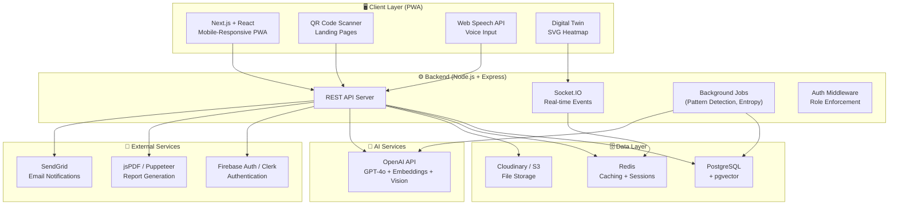
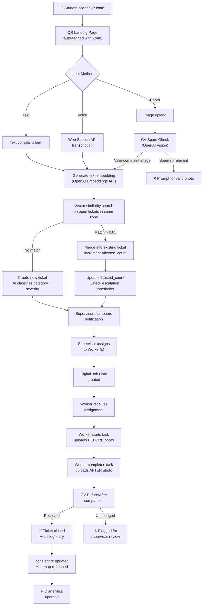
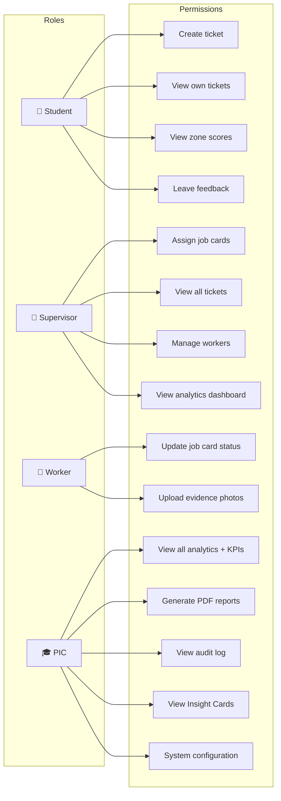
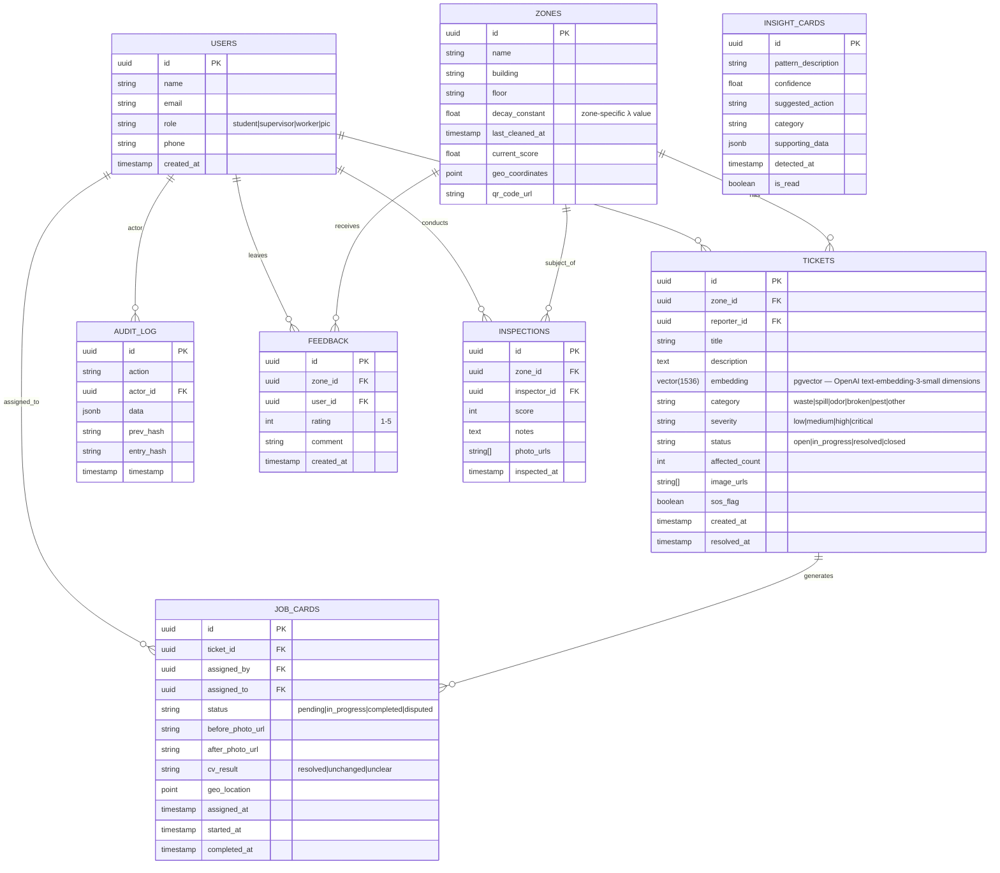
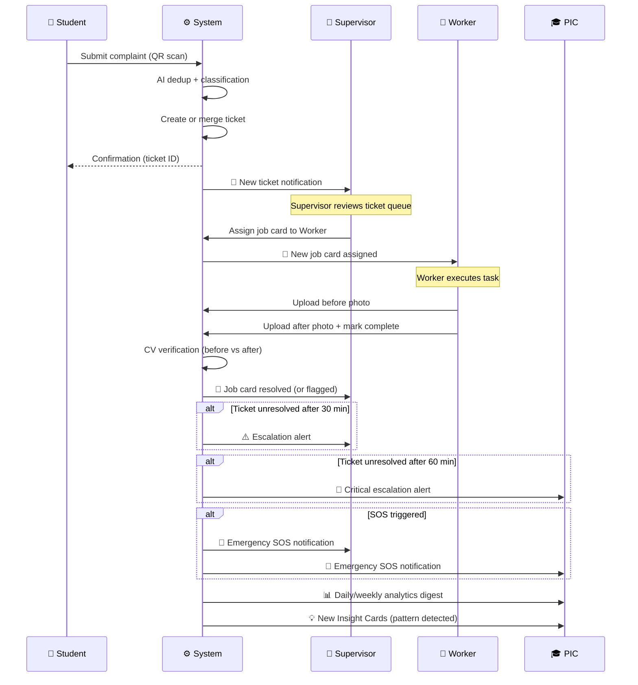

# 🧹 Swachh Campus 360

> *"We don't just track cleanliness — we think about it."*

| | |
|---|---|
| **Team Name** | [Team Name] |
| **College** | Sarvajanik College of Engineering & Technology (SCET) |
| **Hackathon** | [Hackathon Name] |
| **Project** | Swachh Campus 360 — Campus Sanitation Intelligence Platform |

---

## 📋 Table of Contents

1. [Problem Statement](#1-problem-statement)
2. [Proposed Solution — Overview](#2-proposed-solution--overview)
3. [Feature Breakdown](#3-feature-breakdown)
4. [System Architecture](#4-system-architecture)
5. [Tech Stack](#5-tech-stack)
6. [Database Schema](#6-database-schema)
7. [Notification Flow](#7-notification-flow)
8. [Unique Selling Points](#8-unique-selling-points)
9. [Implementation Timeline](#9-implementation-timeline--hackathon-sprint-plan)
10. [Future Scope](#10-future-scope)
11. [Closing Statement](#11-the-winning-pitch)

---

## 1. Problem Statement

### The Reality of Campus Sanitation Today

SCET campus spans **40,000+ square meters** of built area — classrooms, laboratories, canteens, restrooms, corridors, open courtyards, and sports facilities. Keeping this ecosystem clean is a continuous, complex operation. Yet today, it is managed almost entirely through **verbal instructions, paper records, and reactive firefighting**.

### Current Challenges

**No Accountability Loop**
When a restroom is found dirty, who is responsible? When was it last cleaned? Was it cleaned at all? Under the current system, there is no way to answer these questions with confidence. Workers complete their duties without any verifiable evidence. Supervisors rely on memory and word-of-mouth. The Professor-In-Charge (PIC) has no objective performance data.

**Reactive, Not Proactive**
Sanitation action happens only after a complaint. By the time a student reports an overflowing bin or a flooded corridor, the situation has already degraded. There is no mechanism to predict which zones are likely to need attention before a problem becomes visible.

**No Real-Time Visibility**
The PIC, who is ultimately responsible for campus sanitation, has zero real-time visibility into the status of the campus. Reports, if they exist at all, are hand-compiled at the end of the week and contain no granular data. Decisions about resource allocation are made on intuition rather than evidence.

**Complaint Fatigue & Duplicate Reports**
A single garbage pile in the canteen might be reported by 20 different students in a single hour — generating 20 identical tickets that overwhelm the supervisor and obscure which issues are genuinely widespread versus isolated incidents.

**No Evidence of Completion**
Workers mark tasks as "done" verbally. There is no before/after photographic evidence, no geo-tagged confirmation, and no way for the system — or the PIC — to verify that a complaint was actually resolved.

**No Structured Role Hierarchy in Digital Tools**
The campus operates a clear chain of responsibility:
- **PIC** oversees all sanitation operations
- **Supervisor / Head Worker** receives assignments from PIC and manages ground workers
- **Workers** execute cleaning tasks
- **Students** observe and report issues

No existing tool reflects this hierarchy in its workflows, permissions, or notification logic.

### The Cost of Inaction

- Student satisfaction suffers
- Health and hygiene standards decline without early detection
- Accountability gaps erode worker motivation
- The PIC cannot make data-driven decisions for resource optimization
- Audit requirements during inspections cannot be met with paper records

---

## 2. Proposed Solution — Overview

**Swachh Campus 360** is a **campus sanitation intelligence platform** — not just a complaint box with a dashboard.

It is a **pure web-based, mobile-responsive Progressive Web App (PWA)** that digitizes the entire sanitation lifecycle: from a student scanning a QR code to report an issue, through AI-powered deduplication and classification, through supervisor assignment and worker execution with photo evidence, all the way to PIC-level analytics and tamper-proof audit logs.

### Core Philosophy

| Traditional Approach | Swachh Campus 360 |
|---|---|
| Reactive: act after complaints | Proactive: predict before complaints |
| Manual records, no evidence | Digital job cards with photo proof |
| One-size-fits-all dashboard | Role-based views with different workflows |
| Isolated reports | AI-clustered, deduplicated intelligence |
| Black-box audit trail | Cryptographically verifiable event log |

### Role-Based System

```
Student         → Reports issues, provides feedback, triggers escalation
Supervisor      → Receives assignments, manages workers, verifies completion
Worker          → Executes tasks, uploads evidence photos
PIC             → Views analytics, oversees system health, receives AI insights
```

The system enforces this hierarchy in every notification, permission check, and data view. Workers are never contacted directly by students — the supervisor is always the bridge.

---

## 3. Feature Breakdown

### 🔵 Core Features

#### 3.1 QR-Based Reporting System
Every campus location — restroom, lab, corridor, canteen — has a unique **QR code** posted at the entrance. Students scan the code using any smartphone browser (no app install required) and are taken directly to a pre-tagged report form for that exact location.

- Location is auto-embedded in the ticket
- Students can report via text, photo upload, or voice
- Report form available in English, Hindi, and Gujarati

#### 3.2 Digital Job Cards with Geo-Tagging & Photo Evidence
When a supervisor assigns a cleaning task, the system generates a **Digital Job Card** that includes:
- Zone name and GPS coordinates
- Task description derived from complaint category
- Assigned worker and deadline
- Before-photo requirement (captured at task start)
- After-photo requirement (captured at completion)
- Timestamp of every state transition

Workers cannot mark a task "complete" without uploading photographic evidence. The system then runs **Computer Vision verification** on the after-photo to confirm resolution.

#### 3.3 Role-Based Dashboards

**Student Dashboard**
- Submit and track personal reports
- View zone cleanliness scores
- Leave micro-feedback after zone visits

**Supervisor Dashboard**
- Incoming ticket queue with AI-classified priority
- Worker assignment interface
- Live job card status board
- Escalation alerts

**PIC Dashboard**
- Campus-wide cleanliness heatmap (Digital Twin)
- Worker and supervisor performance KPIs
- AI-generated Insight Cards with detected patterns
- Auto-generated PDF summary reports
- Audit log viewer with chain integrity status

#### 3.4 Performance Analytics & Auto-Generated PDF Reports
The system compiles complaint frequency, resolution time, worker efficiency, and zone health trends into structured reports. The PIC can generate a downloadable PDF summary covering any time range — suitable for internal reviews or external audits.

---

### 🤖 AI & Intelligence Features — The Differentiators

#### 3.5 AI Sanitation Copilot + Smart Deduplication

When a student submits a complaint, the system does not blindly create a new ticket. Instead:

1. **Embedding Generation** — The complaint text is converted into a vector embedding using OpenAI's embeddings API.
2. **Similarity Search** — The system queries the vector store (pgvector in PostgreSQL) to find open tickets in the same zone.
3. **Match Decision:**
   - If similarity score > 0.85 AND same zone AND ticket still open → **merge** into existing ticket, increment `affected_count`
     *(The 0.85 threshold is tunable — set conservatively to avoid false merges; can be lowered to 0.75 for broader clustering based on testing)*
   - If no match → **create new ticket** with AI-classified category and severity

**AI Classification:**
- **Category:** `waste | spill | odor | broken_fixture | pest | other`
- **Severity:** `low | medium | high | critical`

**Auto-Escalation based on `affected_count`:**
- > 5 reports on same ticket → auto-escalate to "high" severity
- > 10 reports → "critical" severity + immediate PIC notification

This means that instead of 20 duplicate tickets from the canteen, the supervisor sees **one ticket with `affected_count: 20`** — a single, actionable intelligence unit.

#### 3.6 Computer Vision Complaint Verification

**On Report Submission:**
- Student uploads a photo with their complaint
- OpenAI Vision API (or Google Cloud Vision) analyzes the image
- Detects: garbage accumulation, liquid spills, overflowing bins, graffiti, structural damage
- **Spam Prevention:** If image is irrelevant (selfie, landscape, blank wall), the system flags it and prompts for a valid photo before creating a ticket

**On Task Completion:**
- Worker uploads "after" photo when marking a job card complete
- CV compares before and after images
- Confirms resolution: "Area appears clean — ticket resolved ✅"
- Flags disputed completion: "Conditions appear unchanged — flagged for supervisor review ⚠️"

This creates a **closed-loop verification system** where completion is evidence-based, not self-reported.

#### 3.7 Time-Decay Cleanliness Score (Entropy Model)

Every zone has a real-time **Cleanliness Score** modeled after exponential decay:

```
score(t) = 100 × e^(-λ × hours_since_cleaned)
```

Where λ is the zone-specific **decay constant** representing how quickly a location gets dirty:

| Zone Type | λ Value | Rationale |
|---|---|---|
| Canteen | 0.15 | High footfall, food waste |
| Restrooms | 0.20 | Fastest degradation |
| Classrooms | 0.08 | Moderate use |
| Library | 0.05 | Slowest degradation |
| Corridors | 0.10 | Constant foot traffic |

**Adaptive λ:** The system adjusts λ dynamically based on:
- Day of week (higher on Mondays after weekend)
- Class schedule (higher during heavy use periods)
- Historical complaint frequency for that zone

**Proactive Triggers:**
- Score < 40 → auto-generate proactive cleaning job card
- Score < 20 → escalate to supervisor with urgent flag

This means the system dispatches cleaning crews **before** students start complaining — shifting from reactive to proactive sanitation management.

#### 3.8 Campus Digital Twin + Live Cleanliness Heatmap

An **interactive 2D map of SCET campus** rendered as clickable SVG polygons. Every zone is a live entity:

**Composite Score Formula:**
```
zone_score = (0.30 × time_decay_score)
           + (0.25 × active_complaints_penalty)
           + (0.25 × student_feedback_score)
           + (0.20 × complaint_frequency_trend)
```

**Color-Coded Status:**
- 🟢 Score > 75 — Clean
- 🟡 Score 40–75 — Needs Attention
- 🔴 Score < 40 — Critical

**Zone Click Panel:**
- Full complaint history for that zone
- Currently assigned worker
- Last inspection timestamp
- 7-day trend sparkline chart

**Time-Slider Feature:**
- Replay cleanliness changes over the past 7 days
- Identify recurring problem zones and peak dirt hours

This gives the PIC a **living digital twin** of the campus — not just numbers in a table, but spatial intelligence.

#### 3.9 Voice-First Multilingual Reporting

Students in distress or in a hurry should not need to type. Swachh Campus 360 supports:

- **Web Speech API** for browser-native speech-to-text (no extra library)
- Languages supported: **English, Hindi, Gujarati**
- Transcribed text is sent to the LLM which translates (if needed), classifies, and tags the complaint
- Fully automated ticket creation from a voice note

This serves two goals: **speed** for users who prefer voice, and **inclusion** for non-English speakers.

#### 3.10 Cross-Complaint Pattern Detection ("Insight Cards")

A background analysis job runs periodically (hourly) on the complaint history database and detects patterns using LLM-guided statistical analysis:

**Examples of detected patterns:**
- "Canteen garbage complaints spike every Tuesday between 1–2 PM"
- "Worker W-04 has the highest average resolution time (4.2 hrs vs team average 1.8 hrs)"
- "Rainy days correlate with 3× more spill reports in Ground Floor corridors"
- "Building B restrooms have been in 'critical' state 60% of the past month"

These are surfaced to the PIC as structured **Insight Cards** with:
- Pattern description (human-readable)
- Confidence percentage
- Suggested action

This transforms the PIC's dashboard from a passive display into a **decision-support system**.

#### 3.11 Hash-Chained Tamper-Proof Audit Ledger

Every meaningful event in the system generates an audit log entry. Each entry is **cryptographically linked** to the previous one:

```
entry_hash = SHA256(prev_hash + timestamp + action + actor_id + data_json)
```

**Logged Events include:**
- Ticket created / merged / escalated
- Job card assigned / started / completed
- Photo uploaded / CV result received
- User role changed
- System configuration updated

**Tamper Detection:**
If any record in the database is modified (by a bad actor or accidental data corruption), the hash chain breaks at that point. The system continuously verifies chain integrity and flags any anomaly.

**Why no blockchain?**
This is stored in a standard PostgreSQL table. The security comes from the cryptographic chaining, not from decentralization. This is simpler, faster, and sufficient for campus-scale trust requirements.

This feature ensures that the system's records are **auditable and trustworthy** — critical for any real-world deployment in an institutional context.

#### 3.12 SOS / Escalation System

**Tiered Automatic Escalation** *(thresholds are configurable per campus policy)*:
- Ticket unresolved for **30 minutes** → push notification to Supervisor
- Ticket unresolved for **1 hour** → push notification + email to PIC
- Ticket reaches "critical" severity → immediate multi-channel alert

**Emergency SOS Button:**
Available on every QR scan landing page. For genuine emergencies — biohazard spills, flooding, health hazards — the SOS button:
- Bypasses the normal ticket queue
- Immediately notifies both Supervisor and PIC
- Creates a critical-priority ticket with an "SOS" flag

**Notification Channels:**
- In-app push notifications (service worker via PWA)
- Email via SendGrid / Nodemailer
- Real-time dashboard alerts via Socket.IO

---

## 4. System Architecture

### 4.1 High-Level Architecture



### 4.2 Complaint Lifecycle — Data Flow



### 4.3 Role-Based Access Control



---

## 5. Tech Stack

| Layer | Technology | Purpose |
|---|---|---|
| **Frontend** | Next.js 14 + React + Tailwind CSS | PWA, SSR, routing |
| **Maps / Heatmap** | Leaflet.js + Custom SVG overlays | Digital Twin visualization |
| **Backend** | Node.js + Express.js | REST API, business logic |
| **Database** | PostgreSQL + pgvector | Primary data store + vector search |
| **Cache / Real-time** | Redis | Session caching, Socket.IO adapter |
| **ORM** | Prisma | Type-safe DB access |
| **AI / ML** | OpenAI API (GPT-4o, Embeddings, Vision) | Copilot, dedup, CV verification |
| **Voice** | Web Speech API (browser-native) | Voice-to-text reporting |
| **Real-time** | Socket.IO | Live dashboard updates |
| **Auth** | Firebase Auth or Clerk | Multi-role authentication |
| **File Storage** | Cloudinary or AWS S3 | Before/after photo storage |
| **PDF Reports** | jsPDF or Puppeteer | Downloadable PIC reports |
| **Deployment** | Vercel (frontend) + Railway / Render (backend) | Hosting |
| **QR Generation** | qrcode.js | Zone QR code creation |
| **Email** | SendGrid or Nodemailer | Escalation notifications |

---

## 6. Database Schema



---

## 7. Notification Flow



---

## 8. Unique Selling Points

The following are the features that make Swachh Campus 360 distinct from every other submission:

### 1. 🧠 AI-Powered Smart Deduplication
No other team will implement vector-embedding-based complaint deduplication. While others create one ticket per complaint, we cluster 20 identical reports into one actionable intelligence unit — giving supervisors signal, not noise.

### 2. 📉 Entropy-Based Proactive Cleanliness Decay
Mathematical modeling of cleanliness as a decaying function of time enables **predictions before complaints**. The system dispatches cleaning jobs proactively — a fundamentally different paradigm from every reactive complaint-box solution.

### 3. 👁️ Computer Vision Complaint & Completion Verification
Spam prevention on submission, automated before/after verification on completion. This closes the accountability loop in a way no manual system can. Workers cannot fake completion; students cannot file baseless reports.

### 4. 🗣️ Voice-First Multilingual Reporting (Gujarati / Hindi / English)
Building for the actual users of an Indian campus — not just English speakers. Voice reporting with regional language support is an inclusive design choice that demonstrates real-world thinking.

### 5. 🗺️ Digital Twin Spatial Visualization
A live 2D campus map where every zone is a clickable, color-coded entity with real-time cleanliness data, history, and trend charts. This is not a dashboard — it is a **spatial intelligence system**.

### 6. 🔒 Tamper-Proof Hash-Chained Audit Trail
Cryptographic integrity verification without blockchain infrastructure. Every action is permanently and verifiably logged. This is the kind of feature that earns trust in institutional deployments — and no other hackathon team will have thought of it.

---

## 9. Implementation Timeline — Hackathon Sprint Plan

### Phase 1 — Foundation (40% of time)
**Goal:** Working end-to-end system with core functionality

- [ ] Database schema setup (PostgreSQL + Prisma migrations)
- [ ] Authentication (Firebase Auth / Clerk) + role middleware
- [ ] QR code generation for all zones
- [ ] Basic complaint submission form (text + photo)
- [ ] Supervisor job card creation and assignment
- [ ] Worker job card update (status + after-photo)
- [ ] Role-based dashboards (Student / Supervisor / PIC) — basic UI
- [ ] Real-time notifications via Socket.IO

### Phase 2 — Intelligence (40% of time)
**Goal:** AI features that differentiate us

- [ ] OpenAI Embeddings integration + pgvector setup
- [ ] Deduplication engine (similarity search + merge logic)
- [ ] AI classification (category + severity)
- [ ] OpenAI Vision API integration for spam detection
- [ ] Before/after CV comparison for job card verification
- [ ] Entropy model implementation for zone scores
- [ ] Auto-trigger proactive job cards based on score threshold
- [ ] Auto-escalation timers (30-min, 1-hour)

### Phase 3 — Polish & Wow (20% of time)
**Goal:** Judges see a complete, impressive product

- [ ] Digital Twin SVG heatmap with live score updates
- [ ] Time-slider to replay historical cleanliness states
- [ ] Voice reporting (Web Speech API) in 3 languages
- [ ] Insight Cards (pattern detection job)
- [ ] Hash-chained audit log implementation
- [ ] PDF report generation for PIC
- [ ] SOS button on QR landing page
- [ ] Demo data seeding for all zones and roles
- [ ] Final UI polish + mobile responsiveness

---

## 10. Future Scope

| Feature | Description |
|---|---|
| **Mobile Native Apps** | React Native apps for iOS/Android — offline-first for workers in low-connectivity areas |
| **IoT Integration** | Smart bin sensors, air quality monitors feeding real-time data to supplement complaint data |
| **Multi-Campus Deployment** | Multi-tenant architecture to deploy across multiple colleges or campuses under the same admin |
| **Municipal Integration** | API integration with Surat Municipal Corporation's sanitation systems for broader impact |
| **Carbon Footprint Tracking** | Track cleaning chemical usage and waste disposal to compute and optimize the environmental footprint of sanitation operations |
| **Predictive Staffing** | ML model to recommend optimal worker deployment schedules based on historical patterns and events |
| **Citizen Feedback Portal** | Public-facing zone health status page for transparency with visiting stakeholders |

---

## 11. The Winning Pitch

> *"Every other team built a complaint box with a dashboard.*
>
> *We built a campus sanitation intelligence platform that detects duplicate reports using AI, verifies complaints through computer vision, predicts dirtiness before anyone complains using mathematical decay models, speaks Gujarati, and gives professors a living digital twin of their campus.*
>
> *Swachh Campus 360 doesn't just track cleanliness — it thinks about it."*

---

*Swachh Campus 360 — SCET Hackathon Submission*
